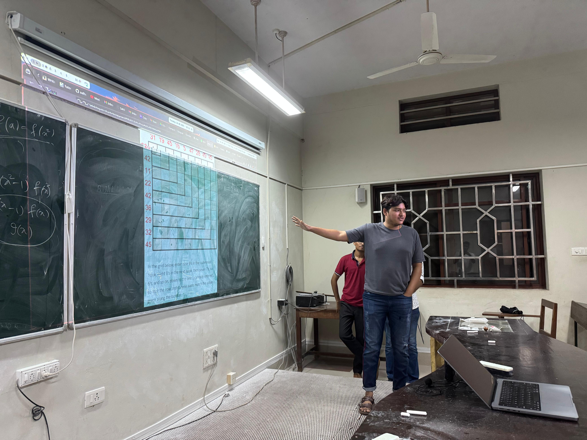

# MathSoc Meeting Minutes
**Author:** Sahil Muhammed  
**Date:** August 26th, 2025  

---

## General Note
- Based on suggestions from the previous meeting, this time we focused on better publicity.  
- An email was circulated by a faculty member to all students, which led to:
  - Increased participation for SMMC.  
  - Higher attendance compared to the last meeting (14 people showed up).  
- The event was also livestreamed on YouTube: [Watch Here](https://www.youtube.com/watch?v=q5nUffFbbVQ).  
  - Due to curfew restrictions on freshmen, only the initial part of the stream was properly covered.  
  - This is an area to improve for upcoming meets and events.  

---

## Commencement
- The meeting began with a discussion of the **Putnam Exam** and how it compares with the **Simon Marais Mathematics Competition (SMMC)**.  
- Members reflected on the elegance of arriving at solutions in mathematics.  
- Insights were shared about potential **internships** and **cash prizes** that top performers in SMMC can receive.  

---

## Activities
- **Past Paper Discussion**  
  - Participants explored questions from previous year SMMC papers.  
  - Dr. Praphulla Koushik (faculty coordinator for SMMC) guided attendees with:  
    - Walkthroughs of selected problems.  
    - Tips for problem-solving endurance (e.g., sitting through 6 hours of exams).  
    - Techniques for reframing problems: start with what you know, attempt simpler versions, then gradually build toward the original problem.  

- **Jane Street Puzzle Walkthrough**  
  - The puzzle: [Jane Street Hooks Puzzle](https://www.janestreet.com/puzzles/hooks-index/).  
  - It was straightforward to understand but required careful incremental reasoning to reach the solution.  

---

## Future Outlook
- Participants were introduced to upcoming problem-solving events such as **NSUCRYPTO**.  
- **Advent of Code** was recommended as an excellent resource for building problem-solving habits, especially in puzzles similar to Jane Street’s.  

---

